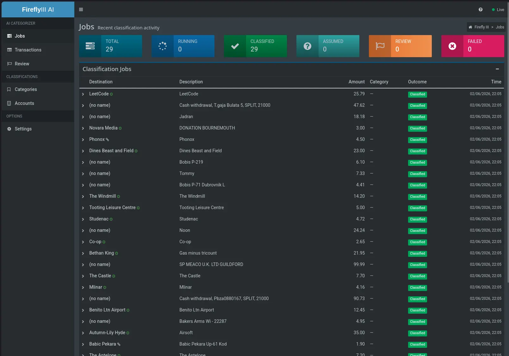
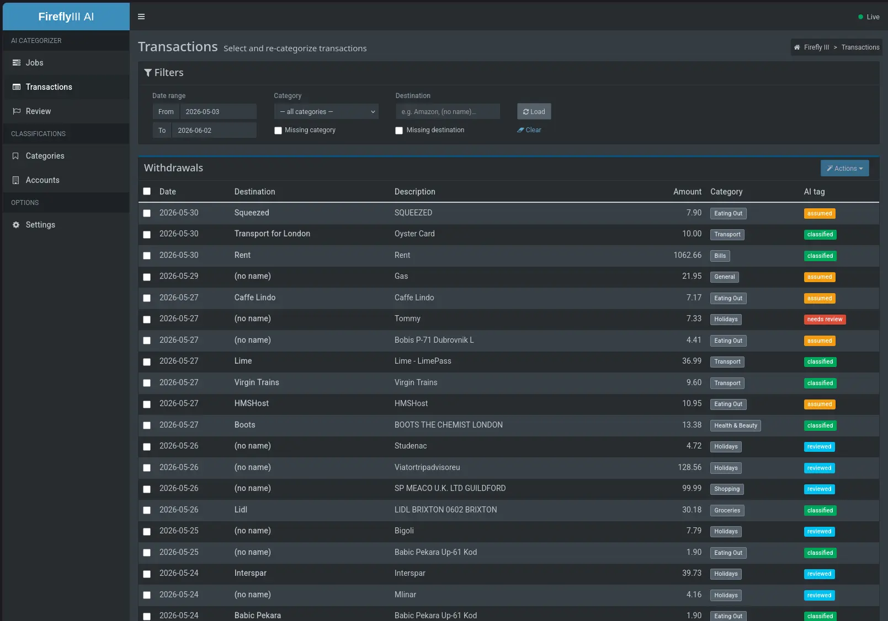
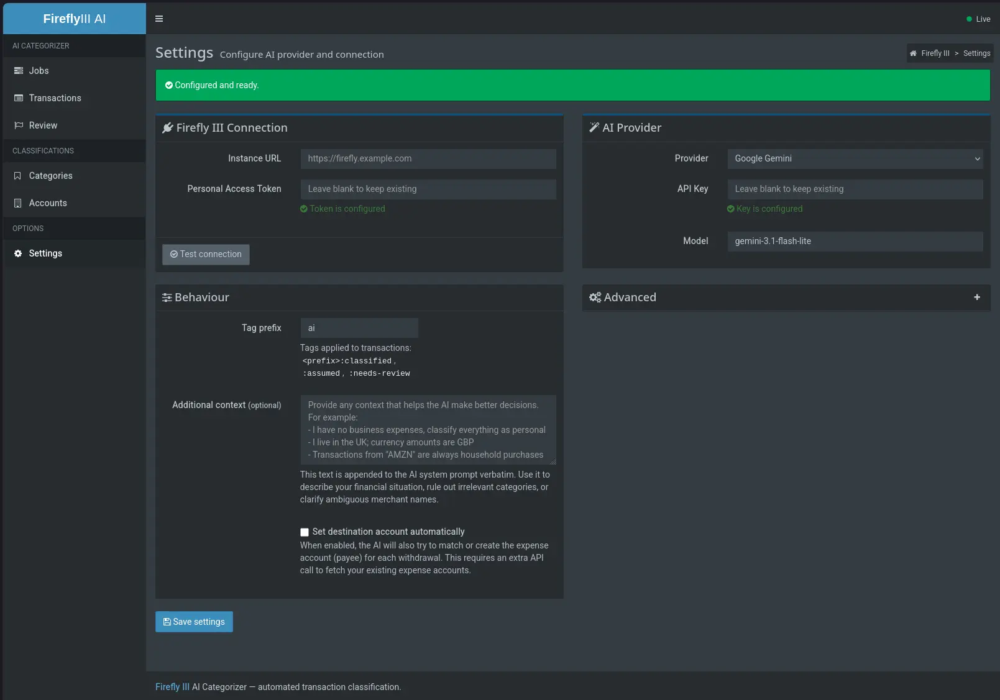

# Firefly III AI Categorizer

Automatically categorise transactions in [Firefly III](https://www.firefly-iii.org/) using an LLM — choose from OpenAI, Gemini, DeepSeek, or locally hosted. New withdrawals are classified into one of three outcomes and written back without any manual intervention. Process transactions automatically using a Firefly III webhook, or use the web interface to mass categorize transactions.



<p>
  
  
</p>

---

## Changes from the original

The original project is [bahuma20/firefly-iii-ai-categorize](https://github.com/bahuma20/firefly-iii-ai-categorize), whose author archived the project. [openaccountants/firefly-iii-ai-categorize](https://github.com/openaccountants/firefly-iii-ai-categorize) forked it and introduced the three-outcome classification model. This project is a fork of that fork, rewritten from scratch with a new UI and additional features:

- **Web UI.** A built-in dashboard, that follows Firefly III design styles, provides real-time job monitoring, a transactions browser with manual re-categorisation, a category viewer, a page to review AI categorisation decisions, and a full settings page.
- **Multiple AI providers.** Supports OpenAI (and any OpenAI-compatible endpoint such as Ollama or Azure OpenAI), Google Gemini, and DeepSeek — switchable from the settings page.
- **Batch categorisation.** All uncategorised withdrawals can be classified in one operation from the UI or the command line.
- **Three-outcome classification model.** Carried forward from the [openaccountants fork](https://github.com/openaccountants/firefly-iii-ai-categorize). The AI discloses its confidence level rather than silently guessing or doing nothing.
- **Transaction history context.** Past categorised transactions are sent to the model as few-shot examples, improving accuracy for recurring merchants. Repeated transactions from the same vendor are categorised automatically, skipping the AI calls entirely.
- **In-UI configuration.** All settings, including credentials, are saved through the web interface and persisted to disk across restarts.
- **Rewritten in Go.** The Node.js/Express server has been replaced with a compiled Go binary, reducing resource usage and removing the Node.js runtime dependency.
- **Destination account matching.** When enabled, the AI can match withdrawals to existing expense accounts or create new ones automatically. The Review page provides a searchable dropdown to correct or create destination accounts manually, and transactions miscategorised as "Transfers" can be converted into real transfer transactions between asset accounts.

---

## Getting started

> [!WARNING]
> This application has no built-in authentication — do not expose it directly to the internet. Run it on a private network or behind a reverse proxy with authentication (e.g. Nginx basic auth over HTTPS).

### 1. Run the server

The recommended way is Docker Compose with a volume mount so settings survive container restarts:

```yaml
services:
  categorizer:
    image: ghcr.io/openaccountants/firefly-iii-ai-categorize:latest
    restart: unless-stopped
    ports:
      - "3000:3000"
    volumes:
      - ./categorizer-data:/data
```

```bash
docker compose up -d
```

Then open **http://localhost:3000** — you will be taken directly to the Settings page.

---

### 2. Connect to Firefly III

In the **Settings → Firefly III Connection** section, enter your Firefly III instance URL and a Personal Access Token.

To create a Personal Access Token in Firefly III, go to your profile and open the **OAuth** tab.

Scroll to **Personal Access Tokens** and click **Create new token**.


Give it a name, confirm, and copy the token that appears — it is only shown once.


Paste the URL and token into the Settings page and click **Test connection** to verify, then **Save settings**.

---

### 3. Add an AI provider

In the **Settings → AI Provider** section, choose a provider and enter your API key.

**OpenAI** — create a key at [platform.openai.com/api-keys](https://platform.openai.com/api-keys). The default model is `gpt-4o-mini`, which is fast and inexpensive.

**Google Gemini** — go to [aistudio.google.com](https://aistudio.google.com), sign in, and click **Get API key**. The default model is `gemini-3.1-flash`.

**DeepSeek** — create an account at [platform.deepseek.com](https://platform.deepseek.com), go to **API keys**, and generate a new key. The default model is `deepseek-chat`.

**Local (Ollama)** — select OpenAI as the provider, set **Base URL** to your Ollama endpoint (e.g. `http://localhost:11434/v1`), leave the API key blank, and set the model name to whichever model you have pulled.

Click **Save settings** when done.

---

### 4. Set up the Firefly III webhook

In Firefly III, go to **Automation → Webhooks** and click **Create new webhook**.

<p>
  
  
</p>

Set the URL to `http://<host>:3000/webhook` and save. New withdrawals will now be sent to the categorizer automatically.


> **Note:** Only withdrawal transactions without an existing category are processed. All other events are acknowledged and ignored.

The categorizer is running. New withdrawals added in Firefly III will appear in the **Jobs** tab as they are classified. Each job shows the outcome, the assigned category, and expandable detail with the AI's reasoning.

---

### Mass Categorization

To classify existing uncategorised transactions, use the **Batch Classification** panel on the Jobs tab — click **Check uncategorized** first to preview the count, then **Run batch** to process them.

You can also select individaul transactions or *all* transactions on the **Transactions** page and force them to be re-categorized.


The **Transactions** tab lets you browse withdrawals, filter by date, and manually trigger re-classification on any selection.

---

### Manual Review

The **Review** tab collects transactions the AI could not classify confidently — either flagged as **Needs Review** (no category set) or **AI Assumed** (a best guess that should be confirmed). Transactions are grouped by merchant, and for Assumed groups the AI's guess is pre-selected in the dropdown. Select a category for each group and click **Apply** to write them back to Firefly III. Use **Skip** to defer a group to the end of the queue without dismissing it.

---

## How it works

```
POST /webhook  (Firefly III sends new transaction)
        │
        ▼
  Validate: withdrawal, no existing category
        │
        ▼
  Fetch history: recent categorised transactions (few-shot examples)
        │
        ▼
  Fetch categories from Firefly III
        │
        ▼
  (Optional) Fetch expense accounts (destination matching)
        │
        ▼
  Send to LLM with three-outcome prompt
        │
        ├── CLASSIFIED    → set category + tag "ai:classified"
        │                    └── destination → MATCH existing or CREATE new
        ├── ASSUMED       → set category + tag "ai:assumed" + assumption
        │                    └── destination → MATCH existing or CREATE new
        └── NEEDS_REVIEW  → tag "ai:needs-review", no category set
                             └── destination → may still be assigned
```

Results are written back to Firefly III with `fire_webhooks: false` to prevent
re-triggering. When destination matching is enabled, the flow also fetches
expense accounts and the LLM attempts to match or create a destination account
alongside the category. Destination confidence is independent of category
confidence — a transaction can be CLASSIFIED for its category but ASSUMED for
its destination, or vice versa.

Repeated transactions from the same merchant benefit from **history-based
matching**: when enough past transactions agree on the same category and
destination, the AI call is skipped entirely, reducing latency and API costs.

---

## CLI usage

### Build from source

Requires Go 1.22 or later.

```bash
git clone https://github.com/ejagombar/FireflyIII-AI-Categorizer.git
cd firefly-iii-ai-categorize
go build -o firefly-ai-categorize ./cmd/server
./firefly-ai-categorize
```

### Batch flag

The `--batch` flag classifies all uncategorised withdrawals and exits without starting the web server. This is useful for scripting or one-off runs:

```bash
./firefly-ai-categorize --batch
```

The server must already be configured — either through a pre-existing config file or via the environment variables below.

---

## Environment variables

All variables are optional. When they are absent, the server starts normally and credentials can be entered through the Settings page. Environment variables take precedence over built-in defaults, but values saved through the UI take precedence over environment variables.

### Firefly III connection

| Variable | Default | Description |
|----------|---------|-------------|
| `FIREFLY_URL` | — | URL of your Firefly III instance |
| `FIREFLY_PERSONAL_TOKEN` | — | Firefly III Personal Access Token |

### AI provider

| Variable | Default | Description |
|----------|---------|-------------|
| `AI_PROVIDER` | `openai` | Provider: `openai`, `gemini`, or `deepseek` |
| `OPENAI_API_KEY` | — | OpenAI API key |
| `OPENAI_MODEL` | `gpt-4o-mini` | OpenAI model name |
| `OPENAI_BASE_URL` | — | Override for OpenAI-compatible APIs (Ollama, Azure, etc.) |
| `GEMINI_API_KEY` | — | Google Gemini API key |
| `GEMINI_MODEL` | `gemini-2.5-flash` | Gemini model name |
| `DEEPSEEK_API_KEY` | — | DeepSeek API key |
| `DEEPSEEK_MODEL` | `deepseek-chat` | DeepSeek model name |

### Server

| Variable | Default | Description |
|----------|---------|-------------|
| `PORT` | `3000` | HTTP port to listen on |
| `ENABLE_UI` | `true` | Set to `false` to disable the web UI |
| `CONFIG_FILE` | `/data/config.json` (Docker) | Path to the persistent settings file |
| `TAG_PREFIX` | `ai` | Prefix for tags written to transactions (`ai:classified`, etc.) |

### Processing

| Variable | Default | Description |
|----------|---------|-------------|
| `WORKER_CONCURRENCY` | `1` | Parallel webhook jobs (increase with caution) |
| `BATCH_CONCURRENCY` | `5` | Parallel jobs during batch runs |
| `HISTORY_CONTEXT_LIMIT` | `5` | Past transactions sent to the model as context examples |
| `HISTORY_LOOKBACK_DAYS` | `90` | How far back to search for history examples |
| `HISTORY_CACHE_TTL` | `10m` | How long to cache the history lookup |

---

## Privacy

Transaction descriptions, destination names, and amounts are sent to the configured AI provider. To keep data on-premises, set `OPENAI_BASE_URL` to a locally-hosted model via [Ollama](https://ollama.com/).

---

## License

AGPL-3.0 — same as the original project.

## Destination account matching

When you enable **Set destination account automatically** in Settings → Behaviour, the AI will also attempt to match or create the expense account (payee) for each withdrawal:

- **MATCH** — the AI finds an existing expense account that corresponds to the merchant.
- **CREATE** — the AI is confident a new account is needed and creates it in Firefly III automatically.

This requires an extra API call to fetch your expense accounts, modestly increasing latency and AI token usage. When disabled, the AI only determines the category and the expense account is left untouched.

On the **Review** page, when enabled, each group card gains a searchable Destination Account field so you can correct or set the payee manually during review. Typing a name that doesn't match any existing account shows a **NEW** badge, indicating a new expense account will be created when you apply.

Additionally, transactions that the AI categorised as "Transfers" appear in a **Convert to Transfers** box below the review cards. These are withdrawals that should actually be transfers between your own asset accounts. Select a destination asset account, and the categorizer deletes the withdrawal and creates a proper transfer in its place.

## Credits

- Original project by [bahuma20](https://github.com/bahuma20/firefly-iii-ai-categorize)
- Three-outcome classification model by [openaccountants/firefly-iii-ai-categorize](https://github.com/openaccountants/firefly-iii-ai-categorize), the intermediate fork this project is based on
